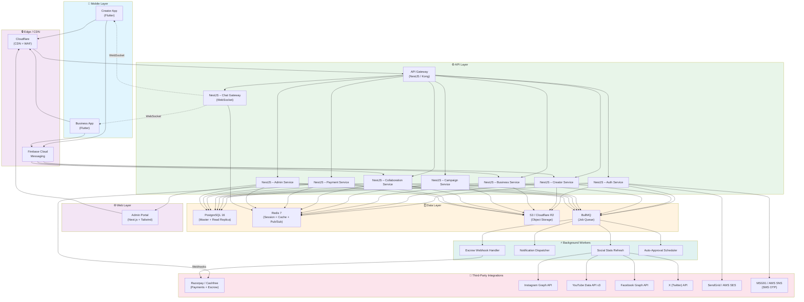

# Creator–Business Collaboration Platform
## System Architecture & Tech Stack Strategy

---

## 1. Recommended Unified Tech Stack

### Frontend — Mobile Apps

| Layer | Technology | Rationale |
|---|---|---|
| **Framework** | **Flutter 3.x (Dart)** | Single codebase for iOS + Android, excellent performance, strong community, good for Indian deployment targets |
| **State Management** | **Riverpod 2.x** | Compile-safe, testable, supports both simple and complex state |
| **Local Storage** | **Hive / Drift (SQLite)** | Offline-first capability, encrypted boxes for sensitive data (earnings, KYC docs) |
| **Image/Media** | **image_picker, video_player** | Standard Flutter packages for media upload/preview |
| **Push Notifications** | **Firebase Cloud Messaging** | Cross-platform, reliable in India, supports high-volume transactional notifications |
| **Auth SDK** | **firebase_auth** | Phone OTP + Email auth; integrates with Firebase Auth for social login later |

> **Why Flutter over React Native?** Flutter's single-render-engine approach eliminates bridge overhead, giving smoother animations for chat and better consistency across the wide Android device fragmentation in India. The team can ship one binary for both platforms.

### Frontend — Admin Portal (Web)

| Layer | Technology | Rationale |
|---|---|---|
| **Framework** | **Next.js 14 (App Router)** | SSR/SSG for dashboard performance, API routes for BFF layer |
| **UI Library** | **shadcn/ui + Tailwind CSS** | Rapid, consistent component development; accessible primitives |
| **State Management** | **TanStack Query (React Query) v5** | Server state caching, optimistic updates, background refetch |
| **Forms** | **React Hook Form + Zod** | Type-safe validation, good DX for complex verification forms |
| **Charts/Analytics** | **Recharts / Tremor** | Financial dashboards, GMV trends |
| **File Uploads** | **react-dropzone** | Document upload for KYC review |

### Backend — API Services

| Layer | Technology | Rationale |
|---|---|---|
| **Runtime** | **Node.js 20+ (TypeScript)** | Large talent pool, excellent async I/O for chat/notifications, shared TS types with web frontend |
| **Framework** | **NestJS** | Modular architecture, built-in DI, guards/pipes/interceptors for security, WebSocket gateway for chat |
| **ORM** | **Prisma** | Type-safe queries, excellent migration tooling, great PostgreSQL support |
| **API Gateway / BFF** | **NestJS (combined)** or **Kong** | For early stage, NestJS modules suffice; scale to Kong if microservice decomposition is needed |
| **Job Queue** | **BullMQ (Redis-backed)** | Social stats refresh, email notifications, webhook retries |

### Data Layer

| Layer | Technology | Rationale |
|---|---|---|
| **Primary DB** | **PostgreSQL 16** | ACID compliance for financial data, JSONB for flexible social stats, strong ecosystem |
| **Cache** | **Redis 7** | Session store, rate limiting, pub/sub for real-time features, BullMQ backing |
| **Object Storage** | **AWS S3 / GCS** (or **Cloudflare R2**) | Deliverable uploads, KYC documents, profile media. R2 offers zero egress cost |
| **CDN** | **Cloudflare** | Fast media delivery across India |

### DevOps & Infrastructure

| Layer | Technology | Rationale |
|---|---|---|
| **Containerization** | **Docker + Docker Compose** | Local dev, CI/CD consistency |
| **Hosting** | **AWS (India region ap-south-1)** or **Vercel (Next.js) + Railway/Render (API)** | India region for low latency; Vercel for admin portal ease |
| **CI/CD** | **GitHub Actions** | Build, test, deploy pipelines |
| **Monitoring** | **Sentry** (errors), **Prometheus + Grafana** (metrics) | Error tracking, APM |
| **Secrets** | **AWS Secrets Manager / Doppler** | Rotating secrets for payment providers |

---

## 2. High-Level Architecture Diagram



### Key Architectural Decisions

1. **Monolithic NestJS Backend (Phase 1)** — Start with a modular monolith. Each domain (Creator, Business, Campaign, Payment, Chat, Admin) is a NestJS module. This keeps deployment simple and avoids distributed-system complexity early. Extract to microservices only when a module needs independent scaling.

2. **Read Replica for PostgreSQL** — Campaign discovery, creator search, and analytics queries are read-heavy. Add a read replica early (at ~10K users) to protect the primary.

3. **BullMQ for Async Work** — Social stat refreshes, notification dispatch, and webhook processing all go through BullMQ for retry/backoff guarantees.

4. **WebSocket Chat via NestJS Gateway** — One gateway service handles chat; uses Redis pub/sub for horizontal scaling of chat instances.

5. **Firebase for Auth + Push** — Phone OTP is essential for Indian users (OTP-based signup). Firebase Auth handles this natively. Firebase Cloud Messaging handles push notifications reliably across Indian carrier networks.

---

## 3. Security & Privacy Architecture (RBAC)

### 3.1 Role Definitions

| Role | Enum Value | Description |
|---|---|---|
| **Creator** | `CREATOR` | Influencer/content creator. Pending verification until manually approved. |
| **Business** | `BUSINESS` | Business entity. Pending verification until documents approved. |
| **Admin** | `ADMIN` | Platform operator. Full access. |
| **Super Admin** | `SUPER_ADMIN` | Top-level. Can manage other admins and platform settings. |

### 3.2 Verification States

```
Users.verificationStatus: PENDING -> UNDER_REVIEW -> VERIFIED | REJECTED
```

- **PENDING**: User registered, documents not yet uploaded.
- **UNDER_REVIEW**: Documents uploaded, awaiting admin review.
- **VERIFIED**: Admin approved. Full platform access.
- **REJECTED**: Admin rejected. User can re-submit.

**Unverified users CANNOT:**
- Create campaigns (Business)
- Apply to campaigns (Creator)
- Access chat
- Make/receive payments

**Unverified users CAN:**
- Edit their profile
- Upload verification documents
- Browse public listings (campaigns / creator profiles, limited view)

### 3.3 RBAC Implementation (NestJS Guards)

```typescript
// roles.decorator.ts
export const Roles = (...roles: UserRole[]) =>
  SetMetadata('roles', roles);

// roles.guard.ts
@Injectable()
export class RolesGuard implements CanActivate {
  constructor(private jwtService: JwtService) {}

  canActivate(context: ExecutionContext): boolean {
    const request = context.switchToHttp().getRequest();
    const user = request.user; // decoded from JWT via AuthGuard

    if (!user) return false;

    // Block unverified users from protected actions
    if (!user.verificationStatus.includes('VERIFIED')) {
      throw new ForbiddenException('Account not verified');
    }

    const requiredRoles = this.reflector.get<UserRole[]>('roles', []);
    return requiredRoles.length === 0 ||
      requiredRoles.some(role => user.roles.includes(role));
  }
}
```

### 3.4 Data Access Policies

| Data Entity | Creator View | Business View | Admin View | Rules |
|---|---|---|---|---|
| **CreatorProfile** | Own profile (full) | Public profile (limited: name, category, verified stats) | All profiles (full) | Earnings, rates, and contact info **never** public. |
| **BusinessProfile** | Public info (name, industry) | Own profile (full) | All profiles (full) | GST/License docs visible only to admin and the business itself. |
| **Campaign** | Creator: browse all (active), manage own collaborations | Full CRUD on own campaigns | All campaigns | Budget visible only after creator is selected. |
| **Collaboration** | Own collaborations only | Own campaign collaborations | All collaborations | Negotiated price visible only to the two parties involved. |
| **Review** | Public (both sides) | Public (both sides) | All reviews | |
| **Payment/Escrow** | Own payouts only | Own payments only | All transactions | Platform fee visible to admin only. |

### 3.5 Sensitive Data Handling

| Data Type | Storage | Access Control |
|---|---|---|
| Creator earnings | Encrypted column in PostgreSQL (`pgcrypto`) | Query-level filter: `WHERE creator_id = auth.user_id` |
| Negotiated rates | JSONB in Collaboration, encrypted | Participants + Admin only |
| KYC documents | S3 with **pre-signed URLs** (expiring in 15 min) | Admin + document owner only |
| Chat messages | PostgreSQL with RLS (Row-Level Security) | Thread participants only |
| Social auth tokens | Redis encrypted, TTL 90 days | Creator only, never exposed to other users |
| Platform commission rate | Environment variable, admin config | Admin only |

### 3.6 API Security Measures

| Measure | Implementation |
|---|---|
| **Authentication** | Firebase Auth -> custom JWT issued by backend on `/auth/exchange` |
| **Authorization** | NestJS `@Roles()` decorator + `RolesGuard` on every protected route |
| **Rate Limiting** | `@nestjs/throttler` - 100 req/min per user, stricter on auth endpoints (5/min) |
| **Input Validation** | `class-validator` + `class-transformer` on all DTOs |
| **CORS** | Whitelisted origins: mobile app schemes, admin portal domain |
| **SQL Injection** | Prisma parameterized queries (handled by ORM) |
| **XSS** | Content-Security-Policy headers, sanitize all user-generated content (chat, reviews) |
| **Secrets** | All API keys, Razorpay keys, social API tokens in AWS Secrets Manager. Rotated quarterly. |
| **Audit Logging** | All admin actions logged to `audit_logs` table with actor, action, timestamp, IP |
| **HTTPS** | Enforced at Cloudflare WAF. TLS 1.3 only. |

### 3.7 RLS Policy Examples (PostgreSQL)

```sql
-- Chat messages: participants only
CREATE POLICY chat_participant_access ON messages
  FOR SELECT USING (
    thread_id IN (
      SELECT ct.id FROM chat_threads ct
      JOIN chat_participants cp ON cp.thread_id = ct.id
      WHERE cp.user_id = auth.uid()
    )
  );

-- Creator earnings: own record only
CREATE POLICY creator_earnings_own ON payments
  FOR SELECT USING (
    collaboration_id IN (
      SELECT id FROM collaborations
      WHERE creator_id = auth.uid()
    )
  );
```

---

## 4. Deployment Topology

```
                        +--------------+
                        |  Cloudflare  |
                        |  (CDN + WAF) |
                        +------+-------+
                               |
                  +------------+------------+
                  |                         |
         +--------+-------+         +-------+--------+
         |  Load Balancer  |         |  Load Balancer  |
         |  (AWS ALB)      |         |  (Admin Portal) |
         +--------+-------+         +-------+--------+
                  |                         |
       +----------+----------+             |
       |          |          |              |
+------+---+ +----+----+ +---+------+        |
| NestJS   | | NestJS  | | NestJS   |        |
| Pod 1    | | Pod 2   | | Pod N    |        |
| (K8s)    | | (K8s)   | | (K8s)    |        |
+----+-----+ +----+----+ +----+-----+        |
     |            |            |              |
     +------------+------------+              |
                  |                            |
     +------------+------------+     +---------+---------+
     |                         |     |  Next.js          |
+----+------+          +------+----+ |  (Vercel)         |
| PostgreSQL|          |  Redis   | |                   |
| (Primary) |          | Cluster  | +-------------------+
+----+------+          +----+-----+
     |                     |
     +----------+----------+
                |
     +----------+----------+
     |  S3 / R2            |
     |  (Object Storage)   |
     +---------------------+
```

**Phase 1 (MVP):** Single NestJS deployment (3-5 pods), managed PostgreSQL (RDS or Supabase), managed Redis (ElastiCache). Total infrastructure: ~$300-500/month at moderate scale.

**Phase 2 (Growth):** Separate service pods for Chat, Payments; add read replica; introduce message queue (SQS or keep BullMQ).

**Phase 3 (Scale):** Full microservice decomposition, Kubernetes orchestration, multi-region.

---

## 5. Summary

| Concern | Choice | Why |
|---|---|---|
| Mobile | Flutter | Single codebase, good India performance |
| Admin Web | Next.js + Tailwind | Fast dashboard development |
| Backend | NestJS + TypeScript | Modular, type-safe, enterprise patterns |
| Database | PostgreSQL 16 | ACID, JSONB, mature ecosystem |
| Cache/Queue | Redis 7 + BullMQ | Fast cache + reliable async jobs |
| Storage | S3 or R2 | Cost-effective, CDN-backed |
| Payments | Razorpay/Cashfree | India-native, escrow/split settlement |
| Chat | NestJS WebSocket + Redis Pub/Sub | Low-latency, horizontally scalable |
| Auth | Firebase Auth (OTP) | Phone-based auth standard in India |
| Infra | AWS (ap-south-1) | India region compliance + latency |
| Monitoring | Sentry + Prometheus + Grafana | Error tracking + metrics |
