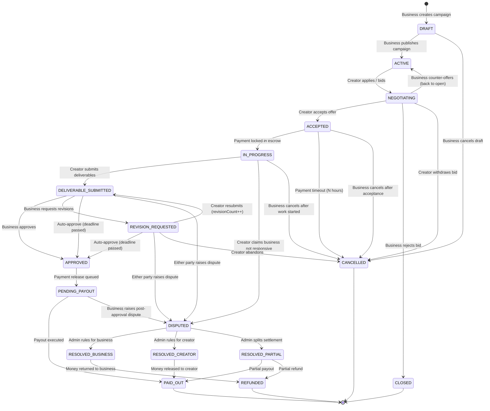

# Creator–Business Collaboration Platform
## Core Business Logic & State Machine Specification

---

## 1. Collaboration Lifecycle State Diagram



---

## 2. State Transition Rules (TypeScript)

```typescript
// src/collaborations/domain/collaboration-states.ts

import { CollaborationStatus } from '@prisma/client';

/**
 * Valid state transitions for collaborations.
 * Each key is a current state; its value array lists allowed next states.
 */
export const VALID_TRANSITIONS: Record<CollaborationStatus, CollaborationStatus[]> = {
  [CollaborationStatus.PENDING]:         [CollaborationStatus.NEGOTIATING, CollaborationStatus.CANCELLED],
  [CollaborationStatus.NEGOTIATING]:     [CollaborationStatus.ACCEPTED, CollaborationStatus.PENDING, CollaborationStatus.CLOSED, CollaborationStatus.CANCELLED],
  [CollaborationStatus.ACCEPTED]:        [CollaborationStatus.IN_PROGRESS, CollaborationStatus.CANCELLED],
  [CollaborationStatus.IN_PROGRESS]:     [CollaborationStatus.DELIVERABLE_SUBMITTED, CollaborationStatus.DISPUTED, CollaborationStatus.CANCELLED],
  [CollaborationStatus.DELIVERABLE_SUBMITTED]: [CollaborationStatus.APPROVED, CollaborationStatus.REVISION_REQUESTED, CollaborationStatus.DISPUTED],
  [CollaborationStatus.REVISION_REQUESTED]:    [CollaborationStatus.DELIVERABLE_SUBMITTED, CollaborationStatus.APPROVED, CollaborationStatus.DISPUTED, CollaborationStatus.CANCELLED],
  [CollaborationStatus.APPROVED]:        [CollaborationStatus.PENDING_PAYOUT],
  [CollaborationStatus.PENDING_PAYOUT]:  [CollaborationStatus.PAID_OUT, CollaborationStatus.DISPUTED],
  [CollaborationStatus.PAID_OUT]:        [],
  [CollaborationStatus.DISPUTED]:        [CollaborationStatus.RESOLVED_BUSINESS, CollaborationStatus.RESOLVED_CREATOR, CollaborationStatus.RESOLVED_PARTIAL],
  [CollaborationStatus.CANCELLED]:       [],
};

/**
 * Throws if the transition is invalid.
 */
export function assertValidTransition(
  current: CollaborationStatus,
  next: CollaborationStatus
): void {
  const allowed = VALID_TRANSITIONS[current];
  if (!allowed.includes(next)) {
    throw new CollaborationTransitionError(current, next);
  }
}

export class CollaborationTransitionError extends Error {
  constructor(from: CollaborationStatus, to: CollaborationStatus) {
    super(`Invalid collaboration transition: ${from} -> ${to}`);
    this.name = 'CollaborationTransitionError';
  }
}
```

---

## 3. State Machine Service

```typescript
// src/collaborations/services/collaboration-state-machine.service.ts

import { Injectable, BadRequestException, ForbiddenException } from '@nestjs/common';
import { Prisma, CollaborationStatus, PaymentStatus, DisputeStatus } from '@prisma/client';
import { CollaborationStateMachinePort } from './collaboration-state-machine.port';
import { CollaborationRepository } from '../repositories/collaboration.repository';
import { PaymentRepository } from '../../payments/repositories/payment.repository';
import { EscrowService } from '../../payments/services/escrow.service';
import { NotificationService } from '../../notifications/services/notification.service';

@Injectable()
export class CollaborationStateMachineService implements CollaborationStateMachinePort {
  constructor(
    private readonly collabRepo: CollaborationRepository,
    private readonly paymentRepo: PaymentRepository,
    private readonly escrowService: EscrowService,
    private readonly notifications: NotificationService,
  ) {}

  // -------------------------------------------------------
  // TRANSITION: Creator accepts an offer
  // -------------------------------------------------------
  async creatorAcceptsOffer(collaborationId: string, creatorId: string): Promise<Collaboration> {
    const collab = await this.collabRepo.findById(collaborationId);
    if (!collab) throw new BadRequestException('Collaboration not found');

    this.assertValidTransition(collab.status, CollaborationStatus.ACCEPTED);
    if (collab.creatorId !== creatorId) {
      throw new ForbiddenException('Only the invited creator can accept');
    }

    // Transition
    const updated = await this.collabRepo.update(collaborationId, {
      status: CollaborationStatus.ACCEPTED,
      acceptedAt: new Date(),
      autoApproveAt: this.computeAutoApproveDeadline(collab),
    });

    // Notify business
    await this.notifications.sendToUser(collab.campaign.businessId, {
      type: 'CREATOR_ACCEPTED',
      title: 'Creator Accepted Your Offer',
      body: `${collab.creator.user.displayName} accepted your campaign offer.`,
      data: { collaborationId },
    });

    return updated;
  }

  // -------------------------------------------------------
  // TRANSITION: Lock payment in escrow
  // -------------------------------------------------------
  async lockEscrow(collaborationId: string, businessId: string): Promise<Payment> {
    const collab = await this.collabRepo.findById(collaborationId);
    if (!collab) throw new BadRequestException('Collaboration not found');
    if (collab.campaign.businessId !== businessId) {
      throw new ForbiddenException('Only the business can lock payment');
    }

    this.assertValidTransition(collab.status, CollaborationStatus.IN_PROGRESS);

    const amount = collab.negotiatedAmount ?? collab.offeredAmount;
    const feePercent = Number(collab.campaign.platformFeePercent);
    const platformFee = this.roundToPaise(amount * (feePercent / 100));
    const creatorPayout = amount - platformFee;

    const payment = await this.escrowService.createHold({
      collaborationId,
      totalAmount: amount,
      platformFee,
      creatorPayout,
    });

    await this.collabRepo.update(collaborationId, {
      status: CollaborationStatus.IN_PROGRESS,
      inProgressAt: new Date(),
      negotiatedAmount: amount,
    });

    await this.notifications.sendToUser(collab.creatorId, {
      type: 'PAYMENT_LOCKED',
      title: 'Payment Secured — Start Your Work',
      body: `Payment of ${this.formatINR(amount)} is held in escrow. Start delivering!`,
      data: { collaborationId },
    });

    return payment;
  }

  // -------------------------------------------------------
  // TRANSITION: Creator submits deliverables
  // -------------------------------------------------------
  async submitDeliverables(
    collaborationId: string,
    creatorId: string,
    deliverables: Array<{ type: DeliverableType; url: string }>,
  ): Promise<Collaboration> {
    const collab = await this.collabRepo.findById(collaborationId);
    if (!collab) throw new BadRequestException('Collaboration not found');
    if (collab.creatorId !== creatorId) {
      throw new ForbiddenException('Only the creator can submit deliverables');
    }

    // Can submit from IN_PROGRESS or REVISION_REQUESTED
    if (
      collab.status !== CollaborationStatus.IN_PROGRESS &&
      collab.status !== CollaborationStatus.REVISION_REQUESTED
    ) {
      throw new BadRequestException(`Cannot submit deliverables in state: ${collab.status}`);
    }

    if (collab.revisionCount >= collab.maxRevisions) {
      throw new BadRequestException('Maximum revision limit reached');
    }

    const deliverableLinks = [...(collab.deliverableLinks ?? []), ...deliverables];

    const updated = await this.collabRepo.update(collaborationId, {
      status: CollaborationStatus.DELIVERABLE_SUBMITTED,
      deliverableLinks,
      submittedAt: new Date(),
    });

    // Notify business
    await this.notifications.sendToUser(collab.campaign.businessId, {
      type: 'DELIVERABLES_SUBMITTED',
      title: 'Deliverables Submitted',
      body: `Creator submitted ${deliverables.length} deliverable(s) for review.`,
      data: { collaborationId },
    });

    return updated;
  }

  // -------------------------------------------------------
  // TRANSITION: Business approves deliverables
  // -------------------------------------------------------
  async approveDeliverables(collaborationId: string, businessId: string): Promise<Collaboration> {
    const collab = await this.collabRepo.findById(collaborationId);
    if (!collab) throw new BadRequestException('Collaboration not found');
    if (collab.campaign.businessId !== businessId) {
      throw new ForbiddenException('Only the business can approve deliverables');
    }

    this.assertValidTransition(collab.status, CollaborationStatus.APPROVED);

    const updated = await this.collabRepo.update(collaborationId, {
      status: CollaborationStatus.APPROVED,
      approvedAt: new Date(),
    });

    // Trigger payout release
    await this.triggerPayoutRelease(collaborationId);

    // Notify creator
    await this.notifications.sendToUser(collab.creatorId, {
      type: 'DELIVERABLES_APPROVED',
      title: 'Deliverables Approved',
      body: 'Your deliverables have been approved! Payment is being processed.',
      data: { collaborationId },
    });

    return updated;
  }

  // -------------------------------------------------------
  // TRANSITION: Business requests revision
  // -------------------------------------------------------
  async requestRevision(
    collaborationId: string,
    businessId: string,
    revisionNote: string,
  ): Promise<Collaboration> {
    const collab = await this.collabRepo.findById(collaborationId);
    if (!collab) throw new BadRequestException('Collaboration not found');
    if (collab.campaign.businessId !== businessId) {
      throw new ForbiddenException('Only the business can request revisions');
    }

    if (collab.revisionCount >= collab.maxRevisions) {
      throw new BadRequestException('Maximum revision limit reached');
    }

    this.assertValidTransition(collab.status, CollaborationStatus.REVISION_REQUESTED);

    const updated = await this.collabRepo.update(collaborationId, {
      status: CollaborationStatus.REVISION_REQUESTED,
      revisionCount: collab.revisionCount + 1,
      approvalNotes: revisionNote,
    });

    await this.notifications.sendToUser(collab.creatorId, {
      type: 'REVISION_REQUESTED',
      title: 'Revision Requested',
      body: `The business requested a revision: "${revisionNote}"`,
      data: { collaborationId },
    });

    return updated;
  }

  // -------------------------------------------------------
  // TRANSITION: Raise dispute
  // -------------------------------------------------------
  async raiseDispute(params: {
    collaborationId: string;
    raisedBy: string;
    category: string;
    reason: string;
  }): Promise<{ collaboration: Collaboration; dispute: Dispute }> {
    const collab = await this.collabRepo.findById(params.collaborationId);
    if (!collab) throw new BadRequestException('Collaboration not found');

    this.assertValidTransition(collab.status, CollaborationStatus.DISPUTED);

    // Transition collaboration
    const updatedCollab = await this.collabRepo.update(params.collaborationId, {
      status: CollaborationStatus.DISPUTED,
    });

    // Create dispute record
    const dispute = await this.disputeRepo.create({
      campaignId: collab.campaignId,
      collaborationId: params.collaborationId,
      raisedBy: params.raisedBy,
      againstUserId: params.raisedBy === collab.creatorId
        ? collab.campaign.business.userId
        : collab.creator.userId,
      category: params.category,
      reason: params.reason,
      status: DisputeStatus.OPEN,
    });

    // Notify both parties and admin
    await Promise.all([
      this.notifications.sendToUser(collab.creatorId, {
        type: 'DISPUTE_RAISED',
        title: 'Dispute Raised',
        body: `A dispute has been raised on this collaboration.`,
      }),
      this.notifications.sendToUser(collab.campaign.businessId, {
        type: 'DISPUTE_RAISED',
        title: 'Dispute Raised',
        body: `A dispute has been raised on this collaboration.`,
      }),
      this.notifications.notifyAdmins({
        type: 'DISPUTE_NEEDS_REVIEW',
        title: 'New Dispute',
        body: `Dispute #${dispute.id} needs admin resolution.`,
      }),
    ]);

    return { collaboration: updatedCollab, dispute };
  }

  // -------------------------------------------------------
  // TRANSITION: Admin resolves dispute
  // -------------------------------------------------------
  async resolveDispute(params: {
    disputeId: string;
    adminId: string;
    resolution: 'BUSINESS' | 'CREATOR' | 'PARTIAL';
    refundAmount?: number;
    payoutAmount?: number;
    notes: string;
  }): Promise<Dispute> {
    const dispute = await this.disputeRepo.findById(params.disputeId);
    if (!dispute) throw new BadRequestException('Dispute not found');

    const newStatus = params.resolution === 'BUSINESS'
      ? DisputeStatus.RESOLVED_BUSINESS
      : params.resolution === 'CREATOR'
        ? DisputeStatus.RESOLVED_CREATOR
        : DisputeStatus.RESOLVED_PARTIAL;

    const updatedDispute = await this.disputeRepo.update(params.disputeId, {
      status: newStatus,
      resolvedBy: params.adminId,
      resolutionNotes: params.notes,
      refundAmount: params.refundAmount ?? 0,
      payoutAmount: params.payoutAmount,
      resolvedAt: new Date(),
    });

    // Execute the financial resolution
    const payment = await this.paymentRepo.findByCollaborationId(dispute.collaborationId);
    if (params.resolution === 'BUSINESS') {
      await this.escrowService.refund(updatedDispute.collaborationId, payment.totalAmount);
      await this.collabRepo.update(dispute.collaborationId, {
        status: CollaborationStatus.REFUNDED,
      });
    } else if (params.resolution === 'CREATOR') {
      await this.escrowService.release(updatedDispute.collaborationId, payment.creatorPayout);
      await this.collabRepo.update(dispute.collaborationId, {
        status: CollaborationStatus.PAID_OUT,
      });
    } else {
      // Partial
      await this.escrowService.release(updatedDispute.collaborationId, params.payoutAmount!);
      await this.escrowService.refund(updatedDispute.collaborationId, params.refundAmount!);
      await this.collabRepo.update(dispute.collaborationId, {
        status: CollaborationStatus.PAID_OUT,
      });
    }

    // Notify parties
    const collab = await this.collabRepo.findById(dispute.collaborationId);
    await Promise.all([
      this.notifications.sendToUser(collab.creatorId, {
        type: 'DISPUTE_RESOLVED',
        title: 'Dispute Resolved',
        body: `The dispute has been resolved: ${params.notes}`,
      }),
      this.notifications.sendToUser(collab.campaign.businessId, {
        type: 'DISPUTE_RESOLVED',
        title: 'Dispute Resolved',
        body: `The dispute has been resolved: ${params.notes}`,
      }),
    ]);

    return updatedDispute;
  }

  // -------------------------------------------------------
  // AUTO-APPROVAL: Business doesn't respond within deadline
  // -------------------------------------------------------
  async processAutoApprovals(): Promise<number> {
    const now = new Date();
    const expiredCollabs = await this.collabRepo.findAutoApproveExpired(now);

    let count = 0;
    for (const collab of expiredCollabs) {
      if (collab.status === CollaborationStatus.DELIVERABLE_SUBMITTED) {
        await this.approveDeliverables(collab.id, collab.campaign.businessId);
        count++;
      } else if (collab.status === CollaborationStatus.REVISION_REQUESTED) {
        // Final auto-approve after revision deadline
        await this.approveDeliverables(collab.id, collab.campaign.businessId);
        count++;
      }
    }
    return count;
  }

  // -------------------------------------------------------
  // CAMPAIGN CLOSE: Expire campaigns past deadline
  // -------------------------------------------------------
  async processExpiredCampaigns(): Promise<number> {
    const expired = await this.campaignRepo.findExpiredActive(new Date());
    let count = 0;
    for (const campaign of expired) {
      await this.campaignRepo.updateStatus(campaign.id, CampaignStatus.CLOSED);
      count++;
    }
    return count;
  }

  // -------------------------------------------------------
  // HELPER: Auto-approve deadline (business.n + 5 days)
  // -------------------------------------------------------
  private computeAutoApproveDeadline(collab: Collaboration): Date {
    const campaign = collab.campaign;
    const days = campaign.autoApproveAfterDays ?? 5;
    const d = new Date();
    d.setDate(d.getDate() + days);
    return d;
  }

  private assertValidTransition(current: CollaborationStatus, next: CollaborationStatus): void {
    const allowed = VALID_TRANSITIONS[current];
    if (!allowed.includes(next)) {
      throw new BadRequestException(
        `Invalid transition: ${current} -> ${next}. Allowed: ${allowed.join(', ')}`
      );
    }
  }

  private async triggerPayoutRelease(collaborationId: string): Promise<void> {
    // Payouts are handled by payment webhooks and a scheduled job
    // Here we set the status to PENDING_PAYOUT
    await this.collabRepo.update(collaborationId, {
      status: CollaborationStatus.PENDING_PAYOUT,
    });
  }

  private roundToPaise(amount: number): number {
    return Math.round(amount * 100) / 100;
  }

  private formatINR(amount: number): string {
    return new Intl.NumberFormat('en-IN', {
      style: 'currency',
      currency: 'INR',
      maximumFractionDigits: 2,
    }).format(amount);
  }
}
```

---

## 4. Scheduled Jobs (Cron)

```typescript
// src/jobs/scheduled-jobs.service.ts

import { Injectable, Logger } from '@nestjs/common';
import { Cron } from '@nestjs/schedule';
import { CollaborationStateMachineService } from '../collaborations/services/collaboration-state-machine.service';

@Injectable()
export class ScheduledJobsService {
  private readonly logger = new Logger(ScheduledJobsService.name);

  constructor(
    private readonly stateMachine: CollaborationStateMachineService,
  ) {}

  // Every hour: auto-approve expired deliverables
  @Cron('0 * * * *') // top of every hour
  async handleAutoApprovals() {
    const count = await this.stateMachine.processAutoApprovals();
    if (count > 0) {
      this.logger.log(`Auto-approved ${count} expired deliverables`);
    }
  }

  // Every hour: expire old active campaigns
  @Cron('0 * * * *')
  async handleExpiredCampaigns() {
    const count = await this.stateMachine.processExpiredCampaigns();
    if (count > 0) {
      this.logger.log(`Closed ${count} expired campaigns`);
    }
  }

  // Every 6 hours: refresh social stats for creators with connected accounts
  @Cron('0 */6 * * *')
  async handleSocialStatsRefresh() {
    // Queued to BullMQ workers; see Prompt 7
    this.logger.debug('Social stats refresh job triggered');
  }

  // Daily: reconcile escrow balances with payment provider
  @Cron('0 2 * * *') // 2 AM IST
  async handleEscrowReconciliation() {
    this.logger.debug('Escrow reconciliation job triggered');
  }

  // Every 15 minutes: release approved payouts
  @Cron('*/15 * * * *')
  async handlePayoutRelease() {
    const pendingPayouts = await this.paymentRepo.findPendingPayouts();
    for (const payment of pendingPayouts) {
      await this.escrowService.releasePayout(payment.id);
    }
  }
}
```

---

## 5. Cancellation & Refund Rules

```typescript
// src/collaborations/services/cancellation.service.ts

export interface CancellationResult {
  refundAmount: number;
  penaltyAmount: number;
  creatorPayout: number;
  note: string;
}

export class CancellationService {
  /**
   * Business cancels BEFORE creator accepts:
   * Full refund, no penalty.
   */
  cancelBeforeAccept(collab: Collaboration): CancellationResult {
    return {
      refundAmount: Number(collab.offeredAmount),
      penaltyAmount: 0,
      creatorPayout: 0,
      note: 'Campaign cancelled before creator acceptance. Full refund issued.',
    };
  }

  /**
   * Business cancels AFTER creator accepts, BEFORE work starts:
   * Full refund to business minus 10% cancellation fee (to creator as compensation).
   */
  cancelAfterAcceptBeforeStart(collab: Collaboration): CancellationResult {
    const total = Number(collab.negotiatedAmount ?? collab.offeredAmount);
    const penalty = this.roundToPaise(total * 0.10);
    const refund = total - penalty;

    return {
      refundAmount: refund,
      penaltyAmount: penalty,
      creatorPayout: penalty,
      note: 'Business cancelled after acceptance. 10% compensation to creator.',
    };
  }

  /**
   * Business cancels AFTER work started:
   * Payment for work done (prorated) + minimum 50% of total to creator.
   */
  cancelAfterWorkStarted(collab: Collaboration): CancellationResult {
    const total = Number(collab.negotiatedAmount ?? collab.offeredAmount);
    const minPayout = this.roundToPaise(total * 0.50);
    const refund = total - minPayout;

    return {
      refundAmount: refund,
      penaltyAmount: minPayout,
      creatorPayout: minPayout,
      note: 'Business cancelled after work started. 50% payout to creator.',
    };
  }

  /**
   * Creator fails to deliver:
   * Full refund to business. Creator gets nothing.
   */
  creatorFailedDeliver(collab: Collaboration): CancellationResult {
    return {
      refundAmount: Number(collab.negotiatedAmount ?? collab.offeredAmount),
      penaltyAmount: 0,
      creatorPayout: 0,
      note: 'Creator failed to deliver. Full refund issued to business.',
    };
  }

  /**
   * Business refuses to approve valid deliverable:
   * Escrow released to creator in full. Business receives nothing.
   */
  businessRefusedValidDeliverable(collab: Collaboration): CancellationResult {
    const total = Number(collab.negotiatedAmount ?? collab.offeredAmount);
    return {
      refundAmount: 0,
      penaltyAmount: 0,
      creatorPayout: total,
      note: 'Business refused valid deliverables. Full payout to creator.',
    };
  }
}
```

---

## 6. Error Codes

| Code | Meaning | HTTP Status |
|---|---|---|
| `COLLAB_INVALID_TRANSITION` | State transition not allowed | 409 Conflict |
| `COLLAB_NOT_FOUND` | Collaboration ID doesn't exist | 404 |
| `REVISION_LIMIT_REACHED` | Max revisions already used | 400 |
| `AUTO_APPROVE_DEADLINE_PASSED` | Cannot submit past deadline | 400 |
| `PAYMENT_ESCROW_FAILED` | Payment hold failed | 502 |
| `PAYOUT_RELEASE_FAILED` | Payout transfer failed | 502 |
| `DISPUTE_ALREADY_OPEN` | Collaboration already disputed | 409 |
| `FORBIDDEN_NOT_PARTY` | User is not a party to this collaboration | 403 |
| `VERIFICATION_REQUIRED` | Account not yet verified | 403 |
| `CAMPAIGN_CLOSED` | Campaign is no longer accepting applications | 400 |
